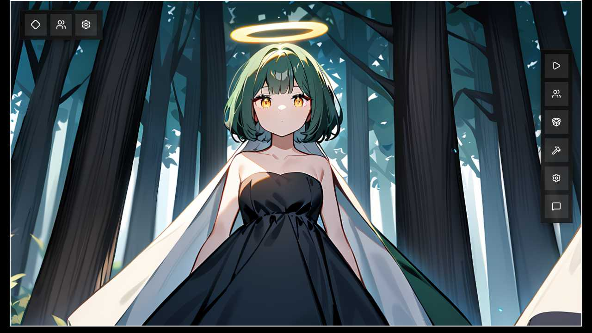
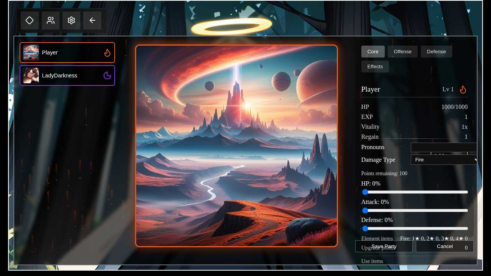
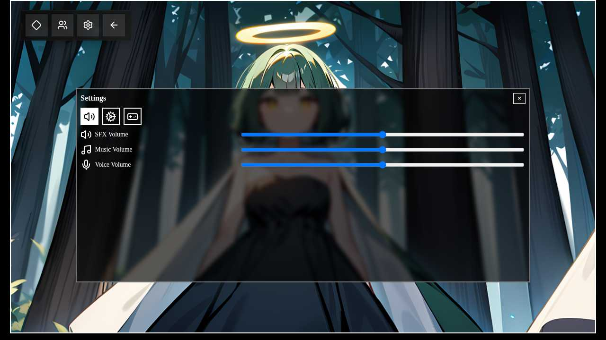
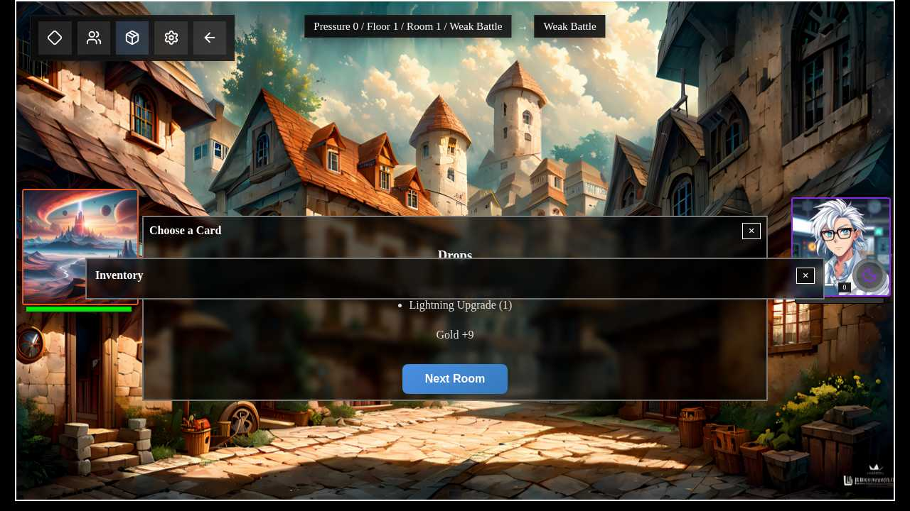

# About Midori AI AutoFighter

Midori AI AutoFighter is a web-based auto-battler game featuring strategic party management, elemental combat, and progressive character development. This document provides detailed information about the game's mechanics, features, and technical implementation.

## What is Midori AI AutoFighter?

Midori AI AutoFighter is being rebuilt as a web application with a Svelte frontend communicating with a Python Quart backend. The game features turn-based combat, character collection, equipment management, and optional AI-powered interactions.

## Directory Structure

```
frontend/   # Svelte frontend
backend/    # Quart backend and game logic
build/      # Build scripts and configuration
.codex/     # Documentation and contributor guides
```

## Game Screenshots and Walkthrough

The following screenshots demonstrate the game's user interface and progression system with comprehensive testing of the fully functional combat system:

### Main Menu - Character Selection


The main menu features a beautiful anime-style character with a mystical halo set against an enchanting forest background. The interface provides clear navigation options for different game modes including Run, Party, Pulls, Settings, and Feedback. The atmospheric lighting and detailed character design showcase the game's high-quality visual presentation.

### Party Selection - Character Customization


The party selection interface demonstrates comprehensive character customization against a stunning fantasy landscape background featuring floating islands and crystalline formations. Players can manage character rosters (Player with Fire element, LadyDarkness with Dark element), configure damage types, distribute stat points using intuitive sliders for HP/Attack/Defense, and manage elemental items with detailed star rating systems. The interface includes full character stats display (HP: 1000/1000, EXP, Vitality, Regain) and upgrade point management for character progression.

### Settings Interface - Audio Controls


The settings overlay provides comprehensive audio management with dedicated controls for SFX Volume, Music Volume, and Voice Volume. The interface features a clean, modern design with tabbed navigation (Audio, System, Gameplay) while maintaining the beautiful character backdrop. The overlay demonstrates proper UI layering and accessibility with clear visual feedback for all interactive elements.

### Card Reward Selection - Battle Completion


The card reward interface appears after successful battle completion, showcasing three beautifully illustrated reward cards against the medieval town backdrop. Players can choose from **Thick Skin** (+3% bleed resist), **Honed Point** (+4% atk), or **Mindful Tassel** (+3% effect hit rate). Each card features detailed artwork and clear statistical benefits, demonstrating the working reward progression system after combat victories.

### Inventory Management 


The inventory interface provides access to collected items, cards, and character progression tracking. This screen becomes available during active runs and allows players to manage their collected resources and review battle rewards.

### Reward Screen Progression

The sequential reward system works as follows:

1. **Card Selection Screen**: When battles offer card rewards, backend sets mode to "card_selection"
2. **Relic Selection Screen**: After card selection, backend automatically advances to "relic_selection" if available
3. **Battle Review Screen**: Final summary screen showing battle results and "Next Room" button
4. **Room Advancement**: Only available after completing all reward screens

This ensures players experience all available rewards in the proper sequence without frontend complexity.

## Game Features

### Action Queue and Turn Order

Combatants take turns based on an action gauge system. Each fighter starts with
10,000 gauge points and spends them according to speed; lower action values act
first. After acting, the combatant's gauge resets to its base and it moves to
the back of the queue. The turn order is displayed in battle as a row of
portraits; the active fighter is highlighted and slides to the end after its
turn. Players can anticipate upcoming moves, and enabling **Show Action Values**
in the options menu reveals each portrait's numeric gauge for debugging.

Animation timing follows each action's duration plus a small pacing buffer.
Players may tweak pacing in the options menu and enable a debug overlay to show
raw action values.

### Responsive Layout

The Svelte frontend targets three breakpoints:

- **Desktop** - displays the party picker, player editor, and icon-based floor map around the active menu so most information is visible at once.
- **Tablet** - shows two panels side by side when space permits.
- **Phone** - focuses on a single menu at a time for clarity on small screens.

The interface adapts automatically based on viewport width.

### Optional LLM Dependencies

When LLM dependencies are installed, the application provides:

- **Model Testing**: Test LLM models through the settings menu (async-friendly to prevent backend lockup)
- **Chat Rooms**: LLM-powered chat interactions with party members
- **Player/Foe Memory**: Persistent conversation memory using ChromaDB vector storage
- **Centralized Management**: Single torch availability check on startup with consistent error handling

All LLM operations are asynchronous and won't block the game interface. Models are loaded in background threads and configured with proper generation parameters to minimize warnings.

### Loot and Rare Drop Rate

Battles award gold, relic choices, upgrade items, and occasionally pull tickets. Gold equals a base value of 5/20/200 for normal, boss, and floor-boss rooms, multiplied by the loop, a random range, and the party's rare drop rate (`rdr`). Relics drop with `10% x rdr` odds in normal fights or `50% x rdr` in boss rooms. Upgrade items use the foe's element, cap at 4★, and their quantity scales with `rdr`-fractions have a matching chance to grant an extra item. Each battle also rolls a `10% x rdr` chance for a pull ticket. `rdr` improves drop quantity and odds and can even upgrade relic or card star ranks with lucky rolls at extreme values: climbing from 3★ to 4★ requires 1000% `rdr`, while 5★ demands a colossal 1,000,000%.

Each foe defeated during a battle temporarily grants +55% `rdr` for that room, raising gold payouts and damage-type item drops.

### Plugins

The game auto-discovers classes under `plugins/` and `mods/` by `plugin_type` and wires them to a shared event bus. The bus yields 0.002 s after each emission to keep the async loop responsive. See `.codex/implementation/plugin-system.md` for loader details and examples. Player and foe plugins also expose `prompt` and `about` strings with placeholder text for future character customization.

Luna's foe form is weighted to appear more frequently and may even show up as a boss when she isn't in the player's party.

### Player Creator

Use the in-game editor to set your pronouns, choose a damage type, and distribute 100 stat points across HP, attack, and defense. Each stat point provides a +1% increase. Spending 100 of each damage type's 4★ upgrade items grants one extra stat point. The customization is stored in the encrypted `save.db` database for new runs.

### Stat Screen

View grouped stats and status effects. The display refreshes every few frames and supports plugin-provided lines. Categories cover core, offense, defense, vitality, advanced data, and status lists for passives, DoTs, HoTs, and damage types.

## Combat System

### Damage and Healing Effects

Elemental damage types hook into attacks. The `plugins/damage_effects.py` module maps each element to its DoT and HoT factories so plugins can request effects without importing one another:

- **[Fire](backend/plugins/damage_types/fire.py)** - Damage scales with missing HP and applies [Blazing Torment](backend/plugins/dots/blazing_torment.py), a stackable DoT that ticks again when the target acts. Its ultimate scorches all foes, dealing attack damage and inflicting Blazing Torment on each, but every use adds a self-burn stack that drains the caster each turn until battle end.
- **[Lightning](backend/plugins/damage_types/lightning.py)** - Pops every active DoT on hit, dealing 25% of each effect's damage immediately, and applies [Charged Decay](backend/plugins/dots/charged_decay.py), which stuns on its final tick. Its ultimate scatters ten random DoTs and permanently grants +1 Aftertaste hit per attack until battle end.
- **[Ice](backend/plugins/damage_types/ice.py)** - Inflicts [Frozen Wound](backend/plugins/dots/frozen_wound.py), which lowers the victim's actions per turn and adds a 1% miss chance per stack. Some skills use [Cold Wound](backend/plugins/dots/cold_wound.py) with a five-stack limit. Ultimate strikes all foes six times, increasing damage 30% per target.
- **[Wind](backend/plugins/damage_types/wind.py)** - After the first hit, repeats the strike on each remaining foe and rolls [Gale Erosion](backend/plugins/dots/gale_erosion.py) on every target, shaving Mitigation each tick. Ultimate: strikes every living foe 25 times with a boosted effect hit rate, greatly increasing Gale Erosion application.
- **[Light](backend/plugins/damage_types/light.py)** - Creates [Celestial Atrophy](backend/plugins/dots/celestial_atrophy.py) and grants allies [Radiant Regeneration](backend/plugins/hots/radiant_regeneration.py) every action. If an ally falls below 25% HP, the attack is replaced with a direct heal.
- **[Dark](backend/plugins/damage_types/dark.py)** - Spreads [Abyssal Corruption](backend/plugins/dots/abyssal_corruption.py) and adds a permanent [Shadow Siphon](backend/plugins/dots/shadow_siphon.py) to each party member every turn, draining 5% max HP per tick while feeding attack and defense back to the caster.

DoT and HoT plugins manage ongoing damage or recovery. Effect hit rate that greatly exceeds a target's resistance can apply multiple DoT stacks in a single attack by looping in 100% hit chunks and subtracting resistance each time. Supported DoTs include [Bleed](backend/plugins/dots/bleed.py), [Poison](backend/plugins/dots/poison.py), [Celestial Atrophy](backend/plugins/dots/celestial_atrophy.py), [Abyssal Corruption](backend/plugins/dots/abyssal_corruption.py), [Abyssal Weakness](backend/plugins/dots/abyssal_weakness.py), [Gale Erosion](backend/plugins/dots/gale_erosion.py), [Charged Decay](backend/plugins/dots/charged_decay.py), [Frozen Wound](backend/plugins/dots/frozen_wound.py), [Blazing Torment](backend/plugins/dots/blazing_torment.py), [Cold Wound](backend/plugins/dots/cold_wound.py), [Twilight Decay](backend/plugins/dots/twilight_decay.py), [Impact Echo](backend/plugins/dots/impact_echo.py), and [Shadow Siphon](backend/plugins/dots/shadow_siphon.py). HoTs cover [Regeneration](backend/plugins/hots/regeneration.py), [Player Echo](backend/plugins/hots/player_echo.py), [Player Heal](backend/plugins/hots/player_heal.py), and [Radiant Regeneration](backend/plugins/hots/radiant_regeneration.py). Foes regenerate at one hundredth the player rate to prevent drawn-out encounters.

## Game Areas

### Battle Room

Start a run in a battle scene that renders character portraits and data, triggers party passives, and runs event-driven stat-based attacks against a `Slime` or any non-party player character scaled by floor, room, Pressure level, and loop count. Foes are procedurally named by prefixing a themed adjective plugin to a player name. Adjective plugins are auto-discovered from files in `plugins/themedadj`, allowing new adjectives to be added without modifying package code. Each adjective applies its stat tweaks through a persistent `StatModifier` buff so base values are restored when the foe falls. Foes inherit from a dedicated `FoeBase` that mirrors player stats but starts with negligible mitigation and vitality; the default `Slime` reduces them by 90% on spawn, while player-derived foes gain `FoeBase` behaviors like turn-based regeneration. The scene shows floating damage numbers and status icons and flashes red and blue with an Enraged buff after 100 turns (500 for floor bosses). Each victory presents three unused cards of the appropriate star rank. Selecting one adds it to the party, and card and relic bonuses are applied at the start of the next battle.

Base battles spawn one foe plus one more for every five Pressure, up to ten. Party size can add bonus enemies: parties of two have a 35% chance to face one extra foe; parties of three roll 35% for two extras else 75% for one. Larger groups follow the same pattern, always capped at ten foes. Boss encounters ignore these rules and always spawn exactly one foe.

5★ cards such as Phantom Ally, Temporal Shield, and Reality Split introduce summoned allies, turn-based damage reduction, and afterimage attacks that echo damage across all foes.

Parties also track a rare drop rate (`rdr`) that boosts relic drops, gold rewards, upgrade item counts, and pull ticket chances. At extreme values it can roll to raise relic and card star ranks (3★->4★ at 1000% `rdr`, 4★->5★ at 1,000,000%), but even huge `rdr` never guarantees success. The 3★ Greed Engine relic raises `rdr` while draining HP each turn. Each slain foe grants a temporary +55% `rdr` bonus for the remainder of the battle, further increasing gold and element upgrade drops.

Defeated foes grant experience to every party member. Characters below level 1000 receive a 10x boost to experience gained so early levels advance quickly. Level-ups apply immediately and sync back to the run along with remaining HP.

### Rest Room

Pull for new characters, craft items, or rearrange the party before continuing a run. Map generation ensures at least two rest rooms per floor, and any recruits join the roster immediately.

### Shop Room

Entering a shop heals the party by 5% of its combined max HP. Buy upgrade items or cards with star ratings. Inventory scales by floor, purchases add items to your inventory and disable the button, class-level tracking guarantees at least two shops per floor, and gold can reroll the current stock. Gold prices per star rank, pressure-based cost scaling, and reroll rules are documented in [`./.codex/implementation/shop-room.md`](.codex/implementation/shop-room.md).

### Battle Review and Chat

Chat interactions with party members are planned to be moved to rest rooms with a limit of approximately 6 messages per visit. When LLM dependencies are installed, players can engage in AI-powered conversations with characters to enhance the narrative experience.

### Per-instance Memory

Each player and foe instance now maintains its own LangChain ChromaDB memory. Use `send_lrm_message` to converse with the LRM and `receive_lrm_message` to record incoming replies. Histories are scoped to the current run so dialogs stay isolated between combatants.

## Map and Progression

### Map Generation

New runs begin by selecting up to four owned allies in a party picker before the map appears. Runs then progress through 45-room floors built by a seeded `MapGenerator`. Each floor includes at least two shops and two rest rooms, battle nodes marked as `battle-weak` or `battle-normal`, and ends in a `battle-boss-floor`. Chat scenes may appear after battles only when the LLM profiles are installed and do not affect room count. The frontend shows these nodes as stained-glass buttons with `lucide-svelte` icons for battles, shops, rests, and bosses.

Across the broader interface, aim for a stained-glass aesthetic. Bar graphs and other visual meters should use vibrant, glass-like colors that mirror the element palette defined in `getElementBarColor` in `frontend/src/lib/BattleReview.svelte`.

## Playable Characters

The roster in `plugins/players/` currently includes and each entry lists its `CharacterType`. All players start with 1000 HP, 100 attack, 50 defense, a 5% crit rate, 2x crit damage, 1% effect hit rate, 100 mitigation, 0 dodge, and 1 in all other stats. Listed damage types use the classic naming from the Pygame version:

- Ally (B, random damage type)
- Becca (B, random damage type)
- Bubbles (A, random damage type)
- Carly (B, Light) – Guardian's Aegis heals the most injured ally, converts attack growth into defense, builds mitigation stacks that can overcharge to add defense to attack while stacks decay each turn, and shares mitigation on ultimate
- Ixia (A, Lightning)
- Graygray (B, random damage type) – retaliates with Counter Maestro after taking damage
- Hilander (A, random damage type) – builds crit rate and damage, unleashing Aftertaste on crit; stack gain odds drop 5% per stack past 20, floored at 1%
- Kboshi (A, random damage type)
- Lady Darkness (B, Dark)
- Lady Echo (B, Lightning)
- Lady Fire and Ice (B, Fire or Ice)
- Lady Light (B, Light)
- Lady of Fire (B, Fire)
- Luna (B, Generic)
- Mezzy (B, random damage type)
- Player (C, chosen damage type)

Characters with a "random damage type" roll their element on first load and reuse that result in future sessions.

## Technical Information

### Standalone Builds

The repository includes automated GitHub Actions workflows to build standalone game executables for multiple platforms. See [BUILD.md](BUILD.md) for complete documentation.

#### Available Builds
- **Windows** (4 variants): non-llm, llm-cpu, llm-cuda, llm-amd
- **Linux** (4 variants): non-llm, llm-cpu, llm-cuda, llm-amd
- **Android**: Currently seeking testers for mobile builds

#### Quick Local Build
```bash
# Build for current platform
./build.sh

# Build specific variant
./build.sh llm-cpu
```

Builds are created for version tags and can be manually triggered via workflow dispatch. Download the latest builds from the [Releases page](../../releases).

### Desktop Builds

Scripts under `build/desktop/` package the app for Windows and Linux. Each script builds a Docker image that compiles the Python backend with PyInstaller and bundles the Svelte frontend with Tauri.

```bash
./build/desktop/build-windows.sh   # outputs .exe to desktop-dist/windows
./build/desktop/build-linux.sh     # outputs .AppImage and .tar.gz to desktop-dist/linux
```

See `.codex/instructions/building-desktop.md` for details.

### Package Installation

Install prebuilt packages when available:

- **Flatpak**

  ```bash
  flatpak install org.midori.ai.autofighter
  ```

- **Arch Linux**

  Currently not available through AUR. Users will need to build from source using `makepkg` and `pacman` dependencies.

- **Debian/Ubuntu**

  ```bash
  sudo apt install ./autofighter.deb
  ```

### Testing

Run the test suites before submitting changes with the helper script:

```bash
./run-tests.sh
```

The script prepares the environments by creating and syncing a Python virtual environment in `backend/` (`uv venv && uv sync`) and installing frontend dependencies with `bun install` in `frontend/`. It then runs each backend `pytest` module via `uv` and executes the frontend `bun test` files. Each test is given a 15-second timeout, and all tests are run regardless of failures. The script prints a summary of any failing or timed-out tests and exits with the first non-zero status code encountered.

### Publishing

Docker images for both services will be published to Docker Hub. Native dependencies are handled inside the images, so no manual wheel management is required.

## Development Information

For development setup, contribution guidelines, and technical documentation, see:

- [DEVELOPMENT.md](DEVELOPMENT.md) - Development environment setup
- [BUILD.md](BUILD.md) - Building and packaging
- [AGENTS.md](AGENTS.md) - Contributor guidelines
- [.codex/](.codex/) - Detailed technical documentation
